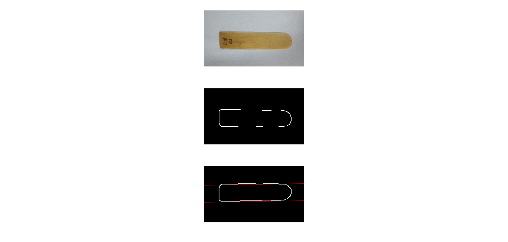

Manual de uso del módulo `detector_aedes`
========================================

## Contexto

Desarrollamos este módulo como parte de una colaboración con el área de Epidemiología de la Ciudad de Buenos Aires. El trabajo fue realizado en el marco de un plan de monitoreo del mosquito Aedes Aegypti por medio de sensores de ovipostura (también conocidos como ovitrampas).

### Sobre los Ovisensores

Los ovisensores son pequeños dispositivos que permiten detectar la presencia de mosquitos del género *aedes* en una dada zona. Estos dispositivos estan compuestos usualmente por un contenedor opaco con agua (generalmente son de cerámica, vidrio o metal) y algún sustrato para que la hembra de mosquito deposite sus huevos (madera, tela, papel). El sensor debe ser revisado regularmente (típicamente una vez por semana) para evaluar la presencia de huevos y reemplazar el sustrato. Esto último es importante para evitar que el sensor se convierta en un criadero.


## Objetivo del módulo

Este modulo tiene como finalidad **asistir en el análisis de datos de ovisensores** detectando y contando automáticamente huevos de aedes en fotos del sustrato de un ovisensor. Es importante destacar que los algoritmos de detección de este módulo están pensados para ovisensores en los que el sustrato sea aproximadamente rectangular y tenga un tamaño estándar. En nuestro caso de uso el sustrato es siempre un bajalenguas de uso médico.

## Funcionalidades

La librería cuenta con funciones para dos objetivos principales:
- **Encontrar un bajalenguas en la imagen**
- **Buscar Elipses oscuras dentro del bajalenguas**

Para simplificar la interaccion con distintas fuentes de imagenes ambas funciones están incuidas en una clase principal `AedesDetector` que itera sobre todas las fotos y graba la salida del proceso de deteccion. Para de definir cual será la fuente de las imagenes (puede ser por ejemplo una carpeta o un servidor de [Open Data Kit](https://opendatakit.org/)) y cual será la salida (por ahora un archivo o una tabla de *Fusion Tables*). Para leer más en detalle el funcionamiento de los conectores ver la seccion sobre [Ingreso y Egreso de los datos](#ingreso-y-egreso-de-los-datos)

## Detalles de Funcionamiento

La estrategia de detección consta de dos etapas. En principio se busca detectar al bajalenguas (el sustrato) y usarlo como referencia geométrica para la búsqueda de huevos. Se asume que todos los bajalenguas tienen un ancho aproximademente estándar y ese ancho se usa para referenciar la escala de la foto.

### Deteccion del Bajalenguas
Para la detección del Bajalenguas se realizan los siguientes pasos:

1. Detección de bordes en la imágen (para esto se usa el método de Canny)
1. Detección de líneas rectas a partir de los bordes usando la transformada de Hough
1. Filtrado de las rectas encontradas en base a su separación y paralelismo. Si se encuentran dos rectas paralelas a una distancia compatible con el ancho de un bajalenguas se toman como válidas.

Abajo se muestra el proceso para una imagen:


Todos las rutinas para la detección del bajalenguas se encuentran contenidas en la clase `StickAnalizerHough`. Para un ejemplo en el que se recorren todas las imagenes de una carpeta y se calculan los límites del bajalenguas se puede leer el [Jupyter Notebook](http://jupyter.org) *Ejemplo de Uso de StickAnalizerHough* que está en la carpeta de ejemplos. Acá presentamos un ejemplo minimal para una sola imagen:

```python
from skimage.io import imread
img_file = '/ruta/a/una/imagen.png'
img = imread(img_file)  # Cargamos la imagen
if np.diff(img.shape[:2]) < 0:  # Chequeamos que la imagen esté apaisada
    img = img.transpose((1, 0, 2))  # Si no es asi la apaisamos
sah.set_current_image(img)  #  Cargamos la imagen en el objeto StickAnalizerHough
status, limits = sah.get_limits()  # obtenemos los limites del bajalenguas
```

### Búsqueda de huevos

La busqueda consiste en hacer aplicar una serie de umbrales de brillo a la imagen blanco y negro. Para cada nivel de umbral se buscan las regiones conexas y se chequean una serie de propiedades geométricas (para mas detalle ver el método `find_in` de la clase `EllipseFinder`). Si la region candidata pasa esos primeros filtros se construye una plantilla de un huevo prototípico compatible con esa región y se calcula la correlación entre la plantilla y la región real de la foto. Se calcula también el contraste para la región. Se define como positiva una región cuya correlación y contraste están por encima de los umbrales establecidos.

#### Regiones conexas de múltiples huevos

Si la región candidata es demasiado grande como para que se trate de un único huevo aislado se hace el intento de crear plantillas de 2, 3 y 4 huevos. Se toma la correlación máxima hallada como la opción más probable.


## Ingreso y Egreso de los datos

Los conectores de entrada y salida sirven como capas de abstracción para permitir interactuar con fuentes de datos que no sean directamente archivos. Para configurar los accesos a un servidor de Open Data Kit se deben completar las credenciales en el archivo
